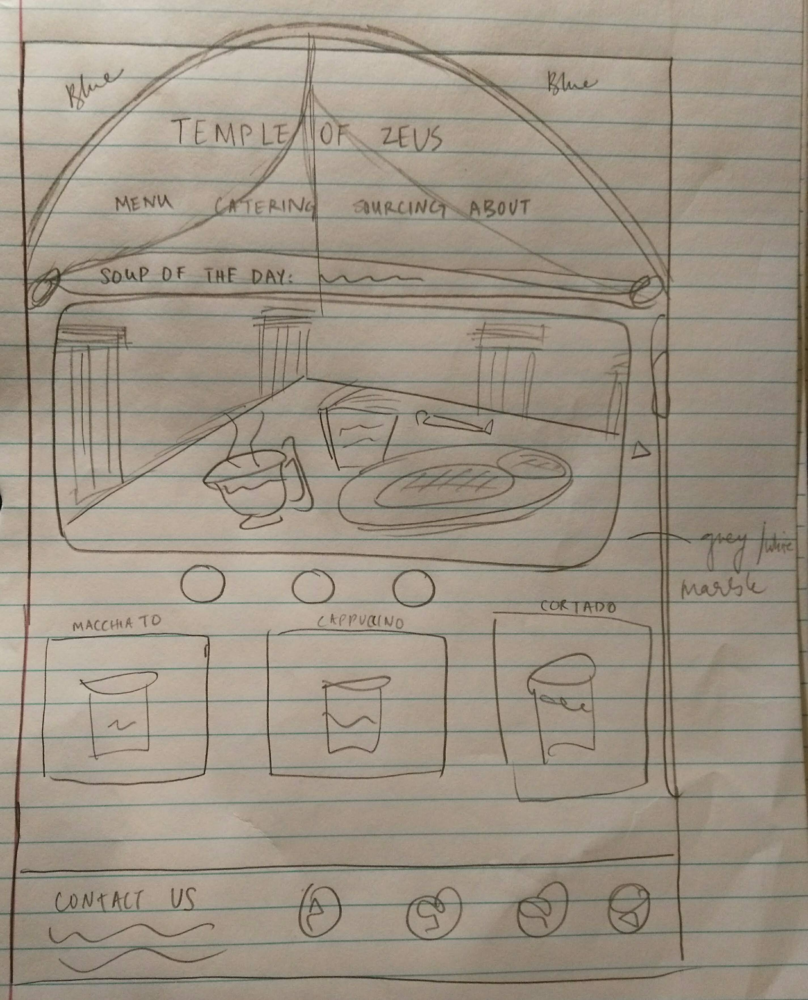

# Project 4: Design Journey

Your Team Name: Orange Bear

**All images must be visible in Markdown Preview. No credit will be provided for images in your repository that are not properly linked in Markdown. Assume all file paths are case sensitive!**

## Client Description

[Tell us about your client. Who is your client? What kind of website do they want? What are their key goals?]

Our client is the Temple of Zeus cafe located in Klarman Hall. They want a website they addresses most of their customer concerns that are prone to getting
lost within workers to managers, such as catering orders, or information that can be inconsistent between workers such as where the cafe items are exactly sourced.

They want a website that contains:
* the menu
  * the soup of the day should somehow be highlighted as many people ask about that often.
* a catering form
* information on product sourcing

Aesthetics of the site:
* Something that is inspired from the envrionment of Klarman atrium where the cafe sits, keeps the color scheme of Klarman.
* Simple, clean design.
* Easy on the eyes, but provides sufficnet information about the client.

[NOTE: If you are redesigning an existing website, give us the current URL and some screenshots of the current site. Tell us how you plan to update the site in a significant way that meets the final project requirements.]

## Meeting Notes

Notes from meeting:

* Customers often ask about why Zeus is so expensive compared to the places on campus that accept BRBs. Workers often have to spend a long time explaining
how things are ethically sourced and that full time workers are paid a living wage. 'It would be nice to have something about how we partner with local
businesses' so customers know the care and attention we go through to source items.

* Catering issues: Often times customers will tell one employee something in the middle of a busy shift and they may forget to tell another worker after them who will be doing the actual preparation about the specifics. If customers were able to fill a form and write exactly what they want at their own time, it would make general service much easier and catering orders more effectively fulfilled. Things form should include: pasteries, coffee amount, utensils, pickup time and general knick knacks needed with order.

* Something highlighting Zeus soup! "I have to text at least two people the Zeus soup of the day because its so popular. We have a menu but it changes every week and its only available on paper that people don't always keep or keep in a safe place to where they can see it at all times they need it"

[By this point, you have met once with your client to discuss all their requirements. Include your notes from the meeting, an email they sent you, or whatever you used to keep track of what was discussed at the meeting. Include these artifacts here.]

## Purpose & Content

[Tell us the purpose of the website and what it is all about.]

The purpose of this website is to provide an online menu, ordering platform, and some information on sourcing so that workers can succintly answer in person to questions on sourcing and catering and refer more interested customers to learn/place orders online.

## Target Audience(s)

[Tell us about the potential audience for this website. How, when, and where would they interact with the website? Get as much detail as possible from the client to help you find representative users.]

Ages: 15-60
Gender: All
Occupation: students, office personnel, and professors.
Office personnel mainly visit the website to make catering orders for meetings and department events. Also, see most up to date menu to check for personal lunch/deli fare.
Students-- mostly regulars, female from meeting notes, check the soup of the day to see if they should grab it as lunch from the cafe.
Students (clubs)-- (lesser) use of catering form to order for club meetings.
Zeus Employees-- need to update soup of the day and check orders!

## Client Requirements & Target Audiences' Needs

[Collect your client's needs and wants for the website. Come up with several appropriate design ideas on how those needs may be met. In the **Rationale** field, justify your ideas and add any additional comments you have. There is no specific number of needs required for this, but you need enough to do the job.]

Audience Needs:
- Catering form
- Menu information
- Sourcing information-- pictures of local sourcing partners and maybe a blog on each place they source from.
- Ability to upload photos for catering items.
- Information on soup of the day/ weekly, dynamic deli+lunch fare!!
  * Have a banner on the top/landing page that shows the soup of the day

## Initial Design

[Include exploratory idea sketches of your website.]

## Information Architecture, Content, and Navigation

[Lay out the plan for how you'll organize the site and which content will go where. Note any content (e.g., text, image) that you need to make/get from the client.]

- **Navigation FINAL**
  - Menu
  - Catering
  - Sourcing
  - About
  - Staff

[Document your process, we want to see how you came up with your content organization and website navigation.]

1st attempt at Navigation)
- **Navigation**
  - About
  - Menu
  - Catering
  - Sourcing

The about is least important to the customer, so it shouldn't be on the landing page. Majority of the customers are coming to look at the menu.

2nd attempt at Navigation)
- **Navigation**
  - Menu
  - Catering
  - Sourcing
  - About
  - Contact Us

  We removed the contact us page because we felt it was unnecessary. All necessary information on who are the important managerial people at Zeus would be included in the about page. A footer would suffice with the social media tags, email, and phone number.

3rd attempt at Navigation)
- **Navigation**
  - Menu
  - Catering
  - Sourcing
  - About
  - Recipes
  - Contact Us

4th attempt at Navigation after second client meeting)
- **Navigation**
  - Menu
  - Catering
  - Sourcing
  - About
  - Login

After coding up the basic outline of all pages and presenting it to Fred, manager of Temple of Zeus, we found that the best nav kept need to know information and really allowed for the staff to make changes to the page after we gave them the site. We ended up removing the recipes page due to a lack of time and difficulty producing the type of recipes page that Temple of Zeus wanted.

- **Process**
  - Navigation sort written above
  - Layout process:
  
  

  - Initial designs:
  

  - [explanation of how your come up with your content organization and navigation.]

  For home page content, we chose the soup of the day to be a banner on the top because it is such a popular piece of information with the target audience. Since the other main purpose of the site is catering, it made sense for menu to be the first thing to be seen. We chose to add an image in the beginning because 'you feast with your eyes first'. The true menu is placed after the large image which shrinks with a quick scroll.

## Interactivity

[What interactive features will your site have? What PHP elements will you include?]

We have certain interactive features on our website, including an:
1. Image gallery
2. Admin page
3. Dynamically changing information based on the day (e.g. soup of the day)
4. Ability to upload images.
5. Ability to delete images.
6. Ability to see what catering orders were placed.

We plan to have image uploads, database queries, and database entries/updates using PHP code.

This will allow the client to take catering orders, upload catering images, deleting catering images, seeing what catering orders were placed and change the soup of the day.

[Also, describe how the interactivity connects with the needs of the clients/target audience.]

Admin page will show who ordered what on the catering form.

## Work Distribution

[Describe how each of your responsibilities will be distributed among your group members.]

* Sarrah will be the website's design lead. She is responsible for the design sketches (initial and final), taking care of fine tuning css and dynamically displayed information. She will keep the group in touch with the target audience perception of the aesthetics of the site. She will do php for the nav and sql for the soup of the day. Initial sketches deadline: 4/16/2019, Refined sketch deadline: 4/17/2019, CSS: 4/26/2019

* Mengfei will be the programming lead focus on database design and php functions related to database. She is responsible for the correctness of website's upload, search functions and dealing with transaction issues. She will help in styling the sourcing page. Initial database design deadline: 4/16/2019, php functions deadline: 4/26/2019.

* Robert will be the 'project manager,' and will coordinate communication with the client and team. He is responsible for communicating with the client, tracking progress, and coordinating efforts. He will also focus his efforts on database processes and PHP. He will focus mainly on the database and php of the catering page along with its styling.

* All will work on the coding of the staff page

## Additional Comments

[If you feel like you haven't fully explained your design choices, or if you want to explain some other functions in your site (such as special design decisions that might not meet the final project requirements), you can use this space to justify your design choices or ask other questions about the project and process.]

Often times although some other person pushed, when we were working together to do the database schema, php, and styling we all contributed but one person ended up pushing as we were discussing through their screen.

--- <!-- ^^^ Milestone 1; vvv Milestone 2 -->

## Client Feedback

[Share the feedback notes you received from your client about your initial design.]

The client liked the designs. They spoke about adding a recipes page as that's another common comment/question they get.
Also, would like to highlight more of the partners the source from. The company's story or the item, like a speciality cheese.
Enjoyed the more minimalist design-- "keep it simple and clean". The information should as accessible as possible.

## Iterated Design

[Improve your design based on the feedback you received from your client.]
Fistly, we designed 6 pages for the website.
index.php -- home page :
 * let customers go through the menu of Zeus

catering.php -- order page :
 * let customers make orders online

sourcing.php
 * show patners infos

about.php
 * show infos relate to our staffs

recipes.php
 * show gradients infos of our products

login.php
 * for staff to login
staff.php
 * for staff to change the soup menu and manage the online orders

Then, we realize that the customers do not need to go the login and staff pages and combine the login and staff pages may make the website easier to go through. So we changed our navbar, delete login.php and show the login form on staff.php if the user has not logged in. We also added the image blogs on catering form for the customer know more about the order food on the same page.

Information is best visually (imagewise) understood so we made the first thing to be seen on all pages an image that preface and ground customers skimming on what the text will be about. We added a recipes page based on client feedback.

## Evaluate your Design

[Use the GenderMag method to evaluate your wireframes.]

[Pick a persona that you believe will help you address the gender bias within your design.]

I've selected **Abby** as my persona.

I've selected my persona because she's the average customer. She's the customer that will help us catch as many bugs as possible as she is least likely to tinker and have a negative experience overall if things that don't work out well on the first try. As this site is meant for an audience that could really go to any other cafe, she is the best person to study and curate the most accessible and user friendly design.

### Tasks

[You will need to evaluate at least 2 tasks (known as scenarios in the GenderMag literature). List your tasks here. These tasks are the same as the task you learned in INFO/CS 1300.]

To really address
[For each task, list the ideal set of actions that you would like your users to take when working towards the task.]

Task 1: Place a catering order
  1. Click on the 'Catering' link in the nav bar.
  2. Enter her name, email, and event name.
  3. Select an order type based on the order she has.
  4. Enter any additional comments.
  5. Select the date/time she needs the order by.
  6. Click submit to submit the order.

  Task 2: Update the soup of the day.
  1. Click on the 'Staff' link in the nav bar.
  2. Log in if not logged in
  3. Select day of the week
  4. Enter soup name
  5. Enter description of soup.
  6. Click change

### Cognitive Walkthrough

[Perform a cognitive walkthrough using the GenderMag method for all of your Tasks. Use the GenderMag template in the <documents/gendermag-template.md> file.]

#### Task 1 - Cognitive Walkthrough
**Task name: Place a catering order for coffee and pastries. **

[Add as many subgoals as you needs]

**Subgoal #1: Navigate to the 'catering' link in the nav bar.**

  - Will Abby have formed this sub-goal as a step to their overall goal?
    - Yes, maybe or no: Yes
    - Why? (Especially consider [persona name]'s Motivations/Strategies.)
      Given that Abby would be considered an 'average' user (e.g. has had some experience working with computers), she would likely know how to navgate to the 'catering' page.

**Action #1: Enter contact details for order, as well as her order and order date/time. **

  - Will Abby have formed this sub-goal as a step to their overall goal?
    - Yes, maybe or no: Yes
    - Why? (Especially consider [persona name]'s Motivations/Strategies.)
      Given that Abby would be considered an 'average' user (e.g. has had some experience working with computers), she would likely know how to input the relevant information for the order.

**Action #2:Submit the order. **

  - Will Abby have formed this sub-goal as a step to their overall goal?
    - Yes, maybe or no: Yes
    - Why? (Especially consider [persona name]'s Motivations/Strategies.)
      Given that Abby would be considered an 'average' user (e.g. has had some experience working with computers), she would likely know how to submit the form after entering all the data.

#### Task 2 - Cognitive Walkthrough
**Task name: Change the soup of the day. **

[Add as many subgoals as you needs]

**Subgoal #1: Navigate to the 'staff' link in the nav bar.**

  - Will Abby have formed this sub-goal as a step to their overall goal?
    - Yes, maybe or no: Yes
    - Why? (Especially consider [persona name]'s Motivations/Strategies.)
      Given that Abby would be considered an 'average' user (e.g. has had some experience working with computers), she would likely know how to navgate to the 'sfaff' page.

**Subgoal #2: If not logged in, log in.**

  - Will Abby have formed this sub-goal as a step to their overall goal?
    - Yes, maybe or no: Yes
    - Why? (Especially consider [persona name]'s Motivations/Strategies.)
      Given that Abby would be considered an 'average' user (e.g. has had some experience working with computers), she would likely know to log in, if the log in form is displayed.

**Action #1: Select day to change.  **

  - Will Abby have formed this sub-goal as a step to their overall goal?
    - Yes, maybe or no: Yes
    - Why? (Especially consider [persona name]'s Motivations/Strategies.)
      Given that Abby would be considered an 'average' user (e.g. has had some experience working with computers), she would likely know how to select the day for which she wants to change the soup.

**Action #2:Enter soup name/description. **

  - Will Abby have formed this sub-goal as a step to their overall goal?
    - Yes, maybe or no: Yes
    - Why? (Especially consider [persona name]'s Motivations/Strategies.)
      Given that Abby would be considered an 'average' user (e.g. has had some experience working with computers), she would likely know to enter the soup name and description.

**Action #3:Submit **

  - Will Abby have formed this sub-goal as a step to their overall goal?
    - Yes, maybe or no: Yes
    - Why? (Especially consider [persona name]'s Motivations/Strategies.)
         Given that Abby would be considered an 'average' user (e.g. has had some experience working with computers), she would likely know how to submit the form after entering all the data.

### Cognitive Walk-though Results

[Did you discover any issues with your design? What were they? How will you change your design to address the gender-inclusiveness bugs you discovered?]

[Your responses here should be **very** thorough and thoughtful.]

For the catering form we realized that since we could not put a date and time to have a placeholder. Since this may cause some confusion due to its potentially ambiguous nature, we explicitly made a label above stating that the date and time were for the order. Especially as traditionally this can mean things such as when they would like to be contacted or even when their event, that needs catering, starts.

However, for the soup of the day task, we found that Abby would likely be able to use the website without problems to change the soup of the day. Hence, we did not feel the need to ammend this process.

Additionally, we realized that Abby is used to the convention of the website logo relinking to home page. To address this we made sure to have the main logo redirect to index.php so that Abby can feel comfortable and all actions of the site have the conventional familiarity when using the website.

If Abby was a worker, upload an image would be a little difficult to understand as to what exact image she would be changing as there are many images on the site. To resolve this, we specified that the uploaded image would change the gallery on the catering page to avoid confusion.

## Final Design

[Include sketches of your finalized design.]

[What changes did you make to your final design based on the results on your cognitive walkthrough?]

We made some significant changes after we realized that alot of the things we had was too much visual (picture) information that took away from the
very important text information. On our staff page, we made adjustments to make the catering gallery more easily interactive to allow employees to shuffle in seasonal or current hot items.

## Database Schema

[Describe the structure of your database. You may use words or a picture. A bulleted list is probably the simplest way to do this.]

Table: categories
* field 1: id {PK, INT, NOT, U}
* field 2: name {TEXT, NOT}

Table: users
* field 1: id {PK, INT, NOT, U}
* field 2: username {TEXT, NOT}
* field 3: password {TEXT, NOT}
* field 4: name {TEXT, NOT}

Table: sessions
* field 1: id {PK, INT, NOT, U}
* field 2: user_id {INTEGER, NOT}
* field 3: session {TEXT, NOT, U}

Table: orders
* field 1: id {PK, INT, NOT, U}
* field 2: order_name {TEXT, NOT}
* field 3: email {TEXT}
* field 4: phone {TEXT}
* field 5: date {TEXT, NOT}
* field 6: time {TEXT, NOT}
* field 7: utensil {TEXT}
* field 8: order_details {TEXT}

Table: soups
* field 1: id {PK, INT, NOT, U}
* field 2: soup_name {TEXT, NOT}
* field 3: soup_desc {TEXT}
* field 4: soup_day {TEXT, NOT, U}

Table: images
* field 1: id {PK, INT, NOT, U}
* field 2: image_extn {TEXT, NOT}
* field 3: image_name {TEXT, NOT}
* field 4: image_desc {TEXT, NOT}

## Database Queries

[Plan your database queries. You may use natural language, pseudocode, or SQL.]
SELECT * FROM users where username = '' AND password = '';
INSERT INTO images (image_name, image_extn, image_desc) VALUES (:image_name, :extension, :description);
UPDATE soups SET soup_name = , soup_desc =  WHERE soup_day = ;
SELECT * FROM images;

## PHP File Structure

[List the PHP files you will have. You will probably want to do this with a bulleted list.]

* includes/init.php - stuff that useful for every web page.
* index.php - main page show the menus.
* about.php - staff blog.
* catering.php - for customers to make orders,  provide menu, image and describtion of the things that could be ordered online
* sourcing.php - show the partner of Zeus
* staff.php - for staff to manage the soup of the day, oline orders and image blog of the website

## Pseudocode

[For each PHP file, plan out your pseudocode. You probably want a subheading for each file.]
### init.php
  1. fuctions relate to DB(open and initiate DB, execute DB)
  2. functions to print the record
  3. functions to check if the user is logged in

### header.php
  1. navbar and user logout link

### footer.php
  1. show contact info and opening hours

### index.php
  1. include init.php
  2. include header.php
  3. show the soup of the day by getting the day and query the soup table
  4. html menus
  5. include footer.php

### catering.php
  1. include init.php
  2. include header.php
  3. if the user submit the catering form:
      * if the order is valid, show success message for the user and insert the data into the orders table
      * if the order is not valid, show wrong message
  4. include footer.php

### sourcing.php
  1. include init.php
  2. include header.php
  3. show the partners info
  4. include footer.php

### staff.php
1. include init.php
2. include header.php
3. if the user is not login, show log in form
4. if the user logged in:
  * show the soup of the day table, change soup form, query orders in DB, upload and delete image form.
  * if the user submit the soup form, update the soup table by the day of the soup
  * if the user submit the image upload form, if it is valid image, save it in the upload directory and store the record in image table
  * if the user submit the image delete form, delete that image in the upload directory and delete the record in image table
5. include footer.php

## Additional Comments

* We think that the recipies page might be too ambitious, given that we have a limited time to work on this project. Consequently, we had to exclude it from this project.

* Furthermore, alot of design iterations were gone through in this project. This was extremely time consuming, and we probably added an additional 15 hours to the project.

* We had some trouble getting information from the client at times, given that the cafe is not open during the weekend (when all of us were most free).

[Add any additional comments you have here.]

--- <!-- ^^^ Milestone 2; vvv Milestone 3 -->

## Issues & Challenges

[Tell us about any issues or challenges you faced while trying to complete milestone 3. Bullet points preferred.]

* We had some trouble accomodating all of the client's request and making sure we had time to do an adequate job on the need to do things like creating a catering form. In the end, we had to make some tough decisions and decided to remove recipes because the desire by the target audience was more for the catering form than it was for recipes and we wanted to do what we did end up doing, well.
* A lot of trouble achieving the style we wanted. Getting things to line up with display: flex and in columns was a bit of a hassle.
* Managing time overall and frustration. We had some sql, php trouble that led to some frustrations, but in the end we ended up figuring it out by having others take turns looking at it. We are also full time students, and hold part-time jobs, making it difficult to get some of the more complex aspects of this project done.

--- <!-- ^^^ Milestone 3; vvv FINAL SUBMISSION-->

## Final Notes to the Clients

[Include any other information that your client needs to know about your final website design. For example, what client wants or needs were unable to be realized in your final product? Why were you unable to meet those wants/needs?]

We were unable to create a recipes page. The amount of recipes to enter (31) and insert into the site would take too long and provided relatively marginal increase in target audience satisfaction and desire to visit Temple of Zeus again. This was done to focus more on the catering form which was a more pertinent and significant corncern for Temple of Zeus.

## Final Notes to the Graders

[1. Give us three specific strengths of your site that sets it apart from the previous website of the client (if applicable) and/or from other websites. Think of this as your chance to argue for the things you did really well.]
1. clean and great css design
2. enable staff to change the soup menu and image blog of the website
3. easy to navigate, all the info is included in the navbar.

* We bumped up the aesthetics of the website.
* Created a space for more dynamic information to be shared with consumers, such as soup of the day, which many employees mentioned was a big concern.
* Streamlined the ordering process and created a single location (staff page) to solve multiple issues that were mentioned in the meeting with the client.

[2. Tell us about things that don't work, what you wanted to implement, or what you would do if you keep working with the client in the future. Give justifications.]
1. We want to have a search page for user to search the food by gradients, someone may only interested in gluten free food and someone may only want to have the food with specific gradient. We want to implement it but the time is not enough for only three of us.

* We wanted to insert a recipies page, but found that this was simply too time consuming. This would be a cool feauture to add later on, if the client would like it!

[3. Tell us anything else you need us to know for when we're looking at the project.]

* The about page with the statues arent place holder images. Its a play on a joke that the Zeus employees have with each other. This was partly to make the clients happy by acknowledging their wish but also because Fred, the manager, was unable to provide the employee images needed.
* During lab critique, a few people asked if we could put the full week's soup menu on the menu page. The reason we did not was that the soup of the day can often change a day before or even the day of.
* It's a great experience to help with a real website, consider user experiences and client needs.

Complexity/Interactivity:
* We did our best to make the website as complex and interactive as possible, while at the same time, making the features that we add relevant to our client.
* We did this by:
  * Creating a soup-of-the-day, as well as the ability for the client to change the soup of the day.
  * Creating a catering page, where visitors can place catering orders and our client can look at them.
  * Allowing the client to add and delete images from the catering page.
